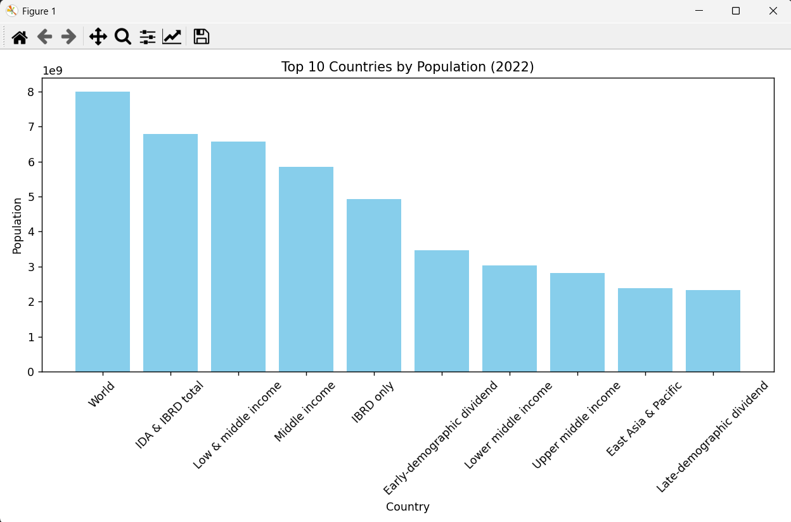
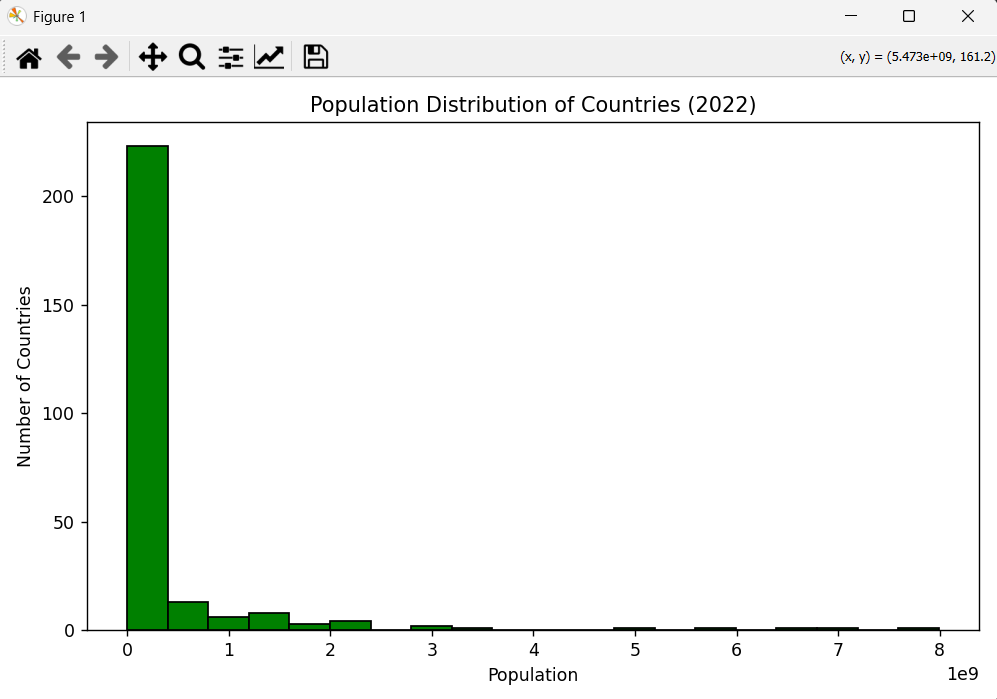

# Population Analysis (2022)

This project analyzes the population data of countries using the World Bank dataset for the year 2022. It uses Python along with pandas and matplotlib to visualize:

- The top 10 most populous countries in 2022
- The overall distribution of population across all countries

---

## Dataset

- Source: World Bank Open Data (https://data.worldbank.org/indicator/SP.POP.TOTL)
- File: API_SP.POP.TOTL_DS2_en_csv_v2_127006.csv
- Location: Placed inside the `population-dataset/` folder
- Columns include population data from 1960 to 2022

---

## Visualizations

- Bar Chart of the Top 10 Countries by Population (2022)
- Histogram of Population Distribution (2022)

---

## Technologies Used

- Python 3.x
- PyCharm 2025.1
- pandas
- matplotlib

---

<pre> ## 📂 Project Structure ```text population-analysis-2022/ ├── dataset/ │ └── population_data.csv ├── images/ │ ├── bar_chart.png │ └── histogram.png ├── population_analysis.py └── README.md ``` </pre>

---

## How to Run

1. Clone the repository:

   git clone https://github.com/your-username/population-analysis-2022.git
   cd population-analysis-2022

2. Install the required libraries:

   pip install pandas matplotlib

3. Run the script:

   python population_analysis.py

**Note:** Ensure the dataset CSV is stored at `dataset/population_data.csv` and the script uses this relative path:

   data = pd.read_csv('dataset/population_data.csv', skiprows=4)

---

## Output

The script will generate:

- A bar chart showing the top 10 most populous countries
- A histogram showing population distribution across all countries

---
## 📈 Output Charts

### 🔹 Top 10 Countries by Population (2022)


### 🔹 Population Distribution Histogram (2022)



## Author

Jhil Chatterjee  
B.Tech in Information Technology  
Aspiring Data Analyst

---

## License

This project is licensed under the MIT License.
